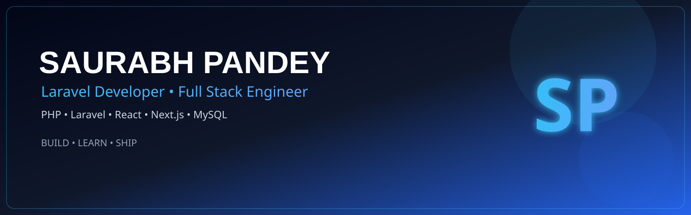

<div align="center">



<br><br>


<br>

<a href="https://github.com/dev-saurabh495">

</a>


</div>

---

#  About Me

```ts
const saurabh = {

    role: "Laravel Developer",

    experience: "1.5+ Years",

    company: "Digital Brain Media",

    location: "India",

    backend: [
        "Laravel",
        "PHP",
        "REST APIs",
        "MySQL"
    ],

    frontend: [
        "React",
        "Next.js",
        "JavaScript",
        "Tailwind CSS",
        "Bootstrap"
    ],

    currentlyLearning: [
        "TypeScript",
        "Node.js",
        "System Design"
    ],

    motto:
      "Build products that solve real-world problems."

}
```


#  Tech Stack

### Languages

<p>


</p>

### Frontend

<p>


</p>

### Backend

<p>


</p>

### Database

<p>


</p>

### Tools

<p>


</p>


#  Featured Projects

<table>

<tr>

<td width="50%">

### 🎓 Top Universities in India

A university discovery platform inspired by CollegeDunia & Shiksha with modern UI, SEO-friendly pages and admin management.

**Tech Stack**


<br><br>

<a href="YOUR_GITHUB_LINK">

</a>

<a href="YOUR_LIVE_LINK">

</a>

</td>

<td>


</td>

</tr>

</table>

---

<table>

<tr>

<td>


</td>

<td width="50%">

### 🏨 Hotel The Spark

Complete hotel booking platform featuring authentication, room management, booking system and admin dashboard.

**Tech Stack**


<br><br>

<a href="YOUR_GITHUB_LINK">

</a>

</td>

</tr>

</table>

---

<table>

<tr>

<td width="50%">

### 📝 Blog Management System

Laravel based blog CMS with authentication, CRUD, categories and dashboard.

**Tech Stack**


</td>

<td>


</td>

</tr>

</table>

---

<table>

<tr>

<td>


</td>

<td width="50%">

### 🛒 E-Commerce Platform

Modern shopping platform with authentication, cart, orders and admin dashboard.

**Tech Stack**


</td>

</tr>

</table>


#  Experience

| Company | Role | Duration |
|----------|------|----------|
| Digital Brain Media | Laravel Developer | Jun 2026 – Present |
| Websofy Software Pvt. Ltd. | Laravel Developer | Oct 2025 – Jun 2026 |
| DigiCoders Technologies | PHP Full Stack Developer | Mar 2025 – Oct 2025 |


#  GitHub Analytics

<p align="center">


</p>

---

#  GitHub Streak

<p align="center">


</p>

---

#  Contribution Graph

<p align="center">


</p>


